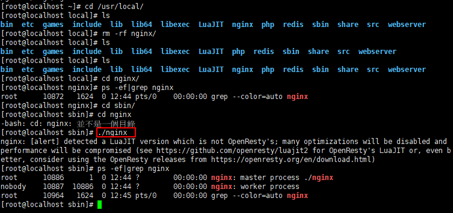
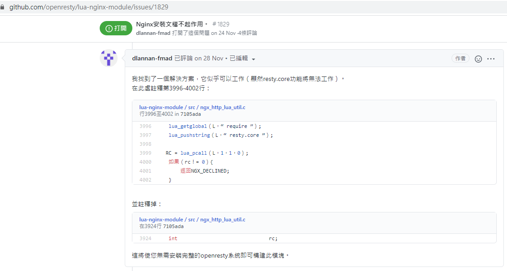

# Nginx加載Lua

默認情況下Nginx不支持Lua模塊，需要安裝LuaJIT解釋器，並且需要重新編譯Nginx

需要下列模塊

- LuaJIT
- ngx_devel_kit
- lua-nginx-module

# Nginx安裝

可參考之前文檔，但只需要到./configure的部分，因為這邊的./configure需要增加擴展

https://github.com/IvesShe/NginxStudy

## 若之前有安裝過nginx，需先找出來並刪掉

```bash
# 找到安裝的目錄
find / -name nginx

# 刪掉安裝的目錄
rm -rm 安裝目錄/
```

## 查看Nginx之前編譯的參數

```bash
/usr/local/nginx/sbin/nginx -V
```


# 下載需要的模塊

下載的資源可統一放在/usr/local/src/下
## LuaJIT

https://luajit.org/download.html


## ngx_devel_kit

https://github.com/vision5/ngx_devel_kit


## lua-nginx-module

https://github.com/openresty/lua-nginx-module


## 解壓對應的模塊

```bash
tar -xvf 模塊全名
```

其它指令可參考之前的文檔

https://github.com/IvesShe/LinuxStudy


# LuaJIT

LuaJIT 是Lua即時編譯器

這邊是裝LuaJIT-2.0.4

解壓並進入目錄安裝

```bash
make && make install
```


# 安裝Nginx並加載模塊

目錄說明

nginx源碼資料夾

/usr/local/src/nginx-1.12.2


nginx安裝資料夾

/usr/local/nginx


## configure

```bash
./configure --prefix=/usr/local/nginx \
--add-module=../nginx_module/ngx_devel_kit-master \
--add-module=../nginx_module/lua-nginx-module-master \
```


成功了


過程中有可能碰到一些報錯，可google對應的錯誤去安裝相關的依賴包


若重新configure或make，可以下指令清一下上一次失敗的檔案

```bash
make clean
rm -f Makefile
```

## make

這邊make單獨執行，是因為這個步驟有可能再報別的錯誤，需要單獨作排除

```bash
make
```


成功了


## make install

```bash
make install
```


成功了


# 補充: 安裝過程的報錯處理

## 錯誤 ./configure: error: the GeoIP module requires the GeoIP library.


安裝依賴
```bash
yum -y install GeoIP GeoIP-devel GeoIP-data
```

## 錯誤  ./configure: error: unsupported LuaJIT version; ngx_http_lua_module requires LuaJIT 2.x.

這問題其實不太好解決，弄了很久

重新下載及安裝，安裝時下參數，指定安裝資料夾
```bash
make install PREFIX=/usr/local/LuaJIT
```

先修改lua-nginx-module-master/config，增加兩行

注意，資料夾及版號要對應真實的名稱
```conf
LUAJIT_INC=/usr/local/LuaJIT/include/luajit-2.0
LUAJIT_LIB=/usr/local/LuaJIT/lib
```


## 錯誤 ./nginx: error while loading shared libraries: libluajit-5.1.so.2: cannot open shared object file: No such file or directory


```bash
ldd /usr/local/webserver/nginx/sbin/nginx -c  /usr/local/webserver/nginx/conf/lua.img.com.conf | grep lua
```

查詢安裝的 libluajit-5.1.so.2

```bash
find / -name  libluajit-5.1.so.2
```

在以下資料夾
/usr/local/lib/
/usr/local/LuaJIT/lib/


由於編譯時沒有生成動態連接，只好手動連接

建立軟連結

```bash
ln -s /usr/local/lib/libluajit-5.1.so.2 /lib64/libluajit-5.1.so.2
```

# 運行Nginx

```bash
cd /usr/local/nignx/sbin
./nginx
```



# 測試效果

成功了


# 修改設定檔測試lua的功能

在nginx.conf中的server增加這一段

```bash
location /test {
            default_type text/html;
            content_by_lua_block {
                ngx.say("hello ives")
            }
        }
```

測試/test的lua代碼功能


成功使用nginx執行Lua的代碼了


# 補充: ./nginx出現報錯的處理

## 錯誤信息

```bash
nginx: [alert] detected a LuaJIT version which is not OpenResty's; many optimizations will be disabled and performance will be compromised (see https://github.com/openresty/luajit2 for OpenResty's LuaJIT or, even better, consider using the OpenResty releases from https://openresty.org/en/download.html)
nginx: [alert] failed to load the 'resty.core' module (https://github.com/openresty/lua-resty-core); ensure you are using an OpenResty release from https://openresty.org/en/download.html (reason: module 'resty.core' not found:
	no field package.preload['resty.core']
	no file './resty/core.lua'
	no file '/usr/local/share/luajit-2.0.4/resty/core.lua'
	no file '/usr/local/share/lua/5.1/resty/core.lua'
	no file '/usr/local/share/lua/5.1/resty/core/init.lua'
	no file './resty/core.so'
	no file '/usr/local/lib/lua/5.1/resty/core.so'
	no file '/usr/local/lib/lua/5.1/loadall.so'
	no file './resty.so'
	no file '/usr/local/lib/lua/5.1/resty.so'
	no file '/usr/local/lib/lua/5.1/loadall.so') in /usr/local/webserver/nginx/conf/nginx.conf:117

```

試了很多方法，但最後只能修改lua-nginx-module這個模塊的源代碼，也許有別的方式，但目前是只有這個解法

修改源代碼以運行nginx



https://github.com/openresty/lua-nginx-module/issues/1829

因為修改了lua-nginx-module-masterd的源代碼，所以運行時會跳警告

```bash
nginx: [alert] detected a LuaJIT version which is not OpenResty's; many optimizations will be disabled and performance will be compromised (see https://github.com/openresty/luajit2 for OpenResty's LuaJIT or, even better, consider using the OpenResty releases from https://openresty.org/en/download.html)
```


